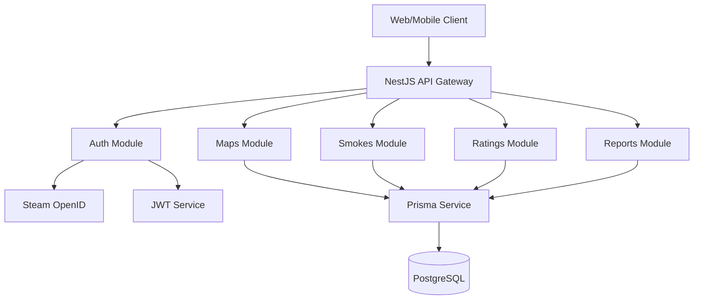
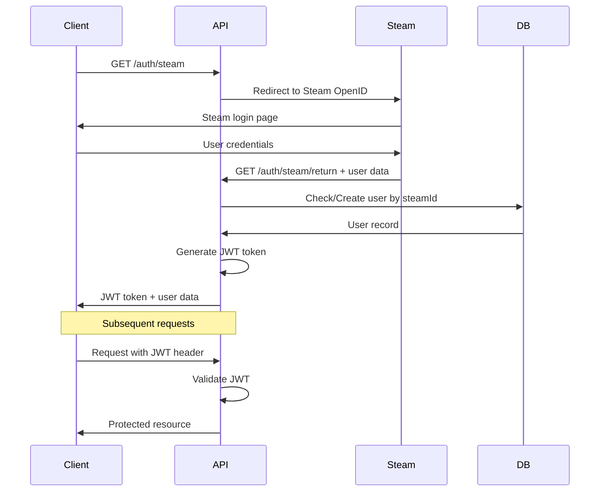

# Design Document

## Overview

The CS2 Smokes Hub API is a NestJS-based RESTful service that enables Counter-Strike 2 players to share, discover, and rate smoke grenade strategies. The system leverages Steam's OpenID authentication for user management, PostgreSQL for data persistence via Prisma ORM, and JWT tokens for session management.

## Architecture

### High-Level Architecture



### Module Structure

The application follows NestJS modular architecture with clear separation of concerns:

- **PrismaModule**: Global database service provider
- **AuthModule**: Steam authentication and JWT management
- **MapsModule**: Map data management
- **SmokesModule**: Smoke strategy CRUD operations
- **RatingsModule**: Rating system for smokes
- **ReportsModule**: Content moderation system

### Authentication Flow



## Components and Interfaces

### Core Services

#### PrismaService
- **Purpose**: Database connection and query execution
- **Scope**: Global singleton
- **Methods**: Extends PrismaClient with connection lifecycle management

#### AuthService
- **Purpose**: User authentication and JWT management
- **Dependencies**: PrismaService, JwtService
- **Key Methods**:
  - `validateSteamUser(profile)`: Create/update user from Steam profile
  - `generateJwtToken(userId)`: Create JWT with user payload
  - `validateJwtPayload(payload)`: Verify JWT and return user

#### MapsService
- **Purpose**: Map data retrieval
- **Dependencies**: PrismaService
- **Key Methods**:
  - `findAll()`: Get all maps
  - `findById(id)`: Get specific map details

#### SmokesService
- **Purpose**: Smoke strategy management with rating calculations
- **Dependencies**: PrismaService
- **Key Methods**:
  - `findByMapId(mapId)`: Get smokes with calculated scores
  - `create(createSmokeDto, authorId)`: Create new smoke
  - `delete(id, userId)`: Delete smoke with ownership validation

#### RatingsService
- **Purpose**: Rating system with upsert functionality
- **Dependencies**: PrismaService
- **Key Methods**:
  - `upsertRating(userId, smokeId, value)`: Create or update rating

#### ReportsService
- **Purpose**: Content moderation system
- **Dependencies**: PrismaService
- **Key Methods**:
  - `create(reportSmokeDto, reporterId)`: Create new report

### Guards and Strategies

#### JwtAuthGuard
- **Purpose**: Protect routes requiring authentication
- **Implementation**: Extends AuthGuard('jwt')
- **Usage**: Applied to protected endpoints via @UseGuards decorator

#### SteamStrategy
- **Purpose**: Handle Steam OpenID authentication
- **Configuration**: Uses STEAM_API_KEY and callback URL
- **Flow**: Validates Steam profile and delegates to AuthService

### DTOs and Validation

#### CreateSmokeDto
```typescript
{
  title: string (required, min: 1, max: 100)
  videoUrl: string (required, URL format)
  timestamp: number (required, positive integer)
  x_coord: number (required, float)
  y_coord: number (required, float)
  mapId: number (required, positive integer)
}
```

#### RateSmokeDto
```typescript
{
  value: number (required, must be 1 or -1)
}
```

#### ReportSmokeDto
```typescript
{
  reason: string (required, min: 10, max: 500)
}
```

## Data Models

### Database Schema Design

The Prisma schema defines the following relationships:

- **User** (1:N) **Smoke**: Users can create multiple smokes
- **Map** (1:N) **Smoke**: Maps contain multiple smokes
- **User** (1:N) **Rating**: Users can rate multiple smokes
- **Smoke** (1:N) **Rating**: Smokes can have multiple ratings
- **User** (1:N) **Report**: Users can create multiple reports
- **Smoke** (1:N) **Report**: Smokes can have multiple reports

### Key Constraints

- **Rating uniqueness**: Composite unique constraint on (userId, smokeId)
- **Cascade deletes**: Ratings and Reports are deleted when Smoke is deleted
- **Steam ID uniqueness**: Each Steam account can only have one user record

### Calculated Fields

#### Smoke Score Calculation
```sql
SELECT s.*, COALESCE(SUM(r.value), 0) as score
FROM Smoke s
LEFT JOIN Rating r ON s.id = r.smokeId
GROUP BY s.id
```

## Error Handling

### HTTP Status Codes

- **200 OK**: Successful GET requests
- **201 Created**: Successful POST requests
- **400 Bad Request**: Validation errors, malformed requests
- **401 Unauthorized**: Missing or invalid JWT token
- **403 Forbidden**: Insufficient permissions (e.g., deleting others' smokes)
- **404 Not Found**: Resource not found
- **500 Internal Server Error**: Unexpected server errors

### Error Response Format

```typescript
{
  statusCode: number
  message: string | string[]
  error?: string
  timestamp: string
  path: string
}
```

### Global Exception Filter

Implements consistent error formatting across all endpoints with:
- Validation error aggregation
- Prisma error translation
- Request context logging
- Security-safe error messages

## Testing Strategy

### Unit Testing

#### Service Layer Tests
- **AuthService**: Steam profile validation, JWT generation/validation
- **SmokesService**: CRUD operations, ownership validation, score calculation
- **RatingsService**: Upsert logic, constraint validation
- **ReportsService**: Report creation and validation

#### Controller Tests
- **Request/Response mapping**: DTO validation, response formatting
- **Guard integration**: Authentication and authorization flows
- **Error handling**: Exception scenarios and status codes

### Integration Testing

#### Database Integration
- **Prisma operations**: CRUD operations with real database
- **Relationship integrity**: Foreign key constraints and cascades
- **Transaction handling**: Multi-table operations

#### Authentication Flow
- **Steam callback simulation**: Mock Steam responses
- **JWT lifecycle**: Token generation, validation, expiration
- **Protected route access**: Guard behavior verification

### End-to-End Testing

#### API Workflows
- **Complete user journey**: Registration → Authentication → Smoke creation → Rating
- **Cross-module interactions**: Smoke creation with map validation
- **Error scenarios**: Invalid data, unauthorized access, missing resources

#### Performance Testing
- **Database query optimization**: N+1 query prevention
- **Response time benchmarks**: Acceptable latency thresholds
- **Concurrent user simulation**: Load testing for rating system

### Test Data Management

#### Fixtures and Factories
- **User factory**: Generate test users with Steam profiles
- **Map seeding**: Consistent map data across test environments
- **Smoke generation**: Realistic smoke data with coordinates

#### Database Cleanup
- **Transaction rollback**: Isolated test execution
- **Seed data reset**: Consistent starting state
- **Foreign key handling**: Proper cleanup order

## Security Considerations

### Authentication Security
- **JWT secret rotation**: Environment-based secret management
- **Token expiration**: Reasonable session timeouts
- **Steam API validation**: Verify Steam profile authenticity

### Input Validation
- **SQL injection prevention**: Prisma parameterized queries
- **XSS protection**: Input sanitization and validation
- **File upload security**: Video URL validation (no direct uploads)

### Authorization
- **Resource ownership**: Users can only modify their own content
- **Role-based access**: Future admin functionality preparation
- **Rate limiting**: Prevent abuse of rating and reporting systems

### Data Privacy
- **Minimal data collection**: Only necessary Steam profile data
- **GDPR compliance**: User data deletion capabilities
- **Audit logging**: Track sensitive operations for security monitoring